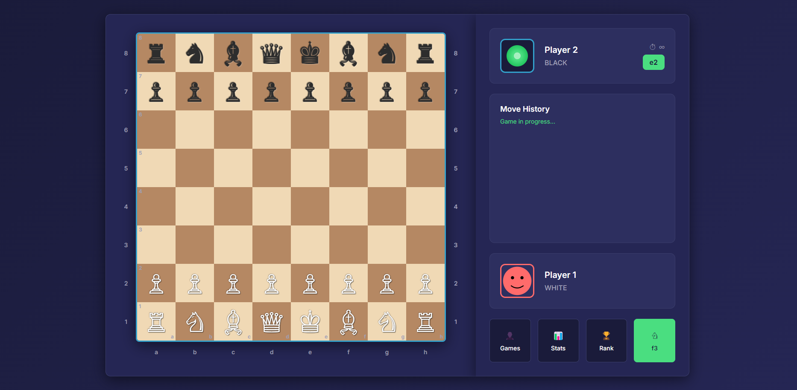

# Chess Game 🏆

A modern, responsive chess game built with HTML5, CSS3, and JavaScript. Features a sleek dark theme UI inspired by modern chess platforms.



## Features

- ♟️ Full chess gameplay with all standard rules
- 🎨 Modern dark theme UI
- 👥 2-player local mode
- 📱 Responsive design
- ⚡ Smooth animations and transitions
- 🎯 Move validation and game state management
- 👑 Checkmate and stalemate detection

## Live Demo

[Play Chess Game](https://your-demo-link.com)

## Getting Started

### Prerequisites

- Modern web browser (Chrome, Firefox, Safari, Edge)
- Local web server (optional, for development)

### Installation

1. Clone the repository:
```bash
git clone https://github.com/yourusername/chess-game.git
cd chess-game
```

2. Open `index.html` in your browser or serve with a local server:
```bash
# Using Python
python -m http.server 8000

# Using Node.js (http-server)
npx http-server

# Using PHP
php -S localhost:8000
```

3. Navigate to `http://localhost:8000` in your browser

## Project Structure

```
chess-game/
├── index.html          # Main HTML file
├── css/
│   ├── styles.css      # Main styles
│   ├── board.css       # Chess board styles
│   └── pieces.css      # Chess pieces styles
├── js/
│   ├── main.js         # Main application logic
│   ├── board.js        # Board management
│   ├── pieces.js       # Piece definitions and movement
│   ├── game.js         # Game state management
│   └── utils.js        # Utility functions
├── assets/
│   ├── pieces/         # Chess piece images
│   └── sounds/         # Game sound effects
└── README.md
```

## How to Play

1. **Start Game**: The game begins with white pieces at the bottom
2. **Make Moves**: Click on a piece to select it, then click on a valid square to move
3. **Turn-based**: Players alternate turns (white moves first)
4. **Special Moves**: Castling, en passant, and pawn promotion are supported
5. **Win Conditions**: Game ends on checkmate, stalemate, or draw

## Development

### Adding Features

- **AI Opponent**: Implement minimax algorithm for computer player
- **Online Multiplayer**: Add WebSocket support for real-time games
- **Game Analysis**: Add move history and analysis features
- **Time Controls**: Implement chess clocks and time limits

### Code Style

- Use ES6+ features
- Follow consistent naming conventions
- Comment complex game logic
- Maintain separation of concerns

## Contributing

1. Fork the repository
2. Create a feature branch (`git checkout -b feature/amazing-feature`)
3. Commit your changes (`git commit -m 'Add amazing feature'`)
4. Push to the branch (`git push origin feature/amazing-feature`)
5. Open a Pull Request

## License

This project is licensed under the MIT License - see the [LICENSE](LICENSE) file for details.

## Acknowledgments

- Chess piece designs inspired by modern chess platforms
- UI/UX inspired by Chess.com and Lichess
- Built with vanilla JavaScript for performance and simplicity

## Contact

Your Name - your.email@example.com

Project Link: [https://github.com/yourusername/chess-game](https://github.com/yourusername/chess-game)
